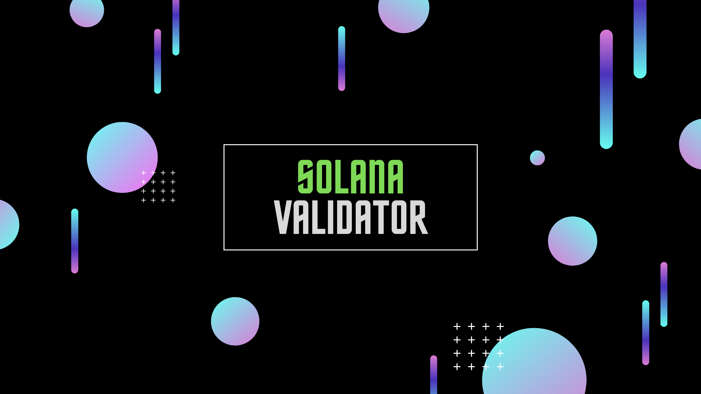

# Solana Validator
<!-- ALL-CONTRIBUTORS-BADGE:START - Do not remove or modify this section -->

<!-- ALL-CONTRIBUTORS-BADGE:END -->
A home for Solana validator resources

## Banner

## Tour de Sol (TdS) PICO Inflation

For more details see [here](tds-pico-inflation/README.md)

## Mainnet Beta (MB) Validator Workshop

For more details see [here](mb-validator-workshop/README.md)
## Contributors ✨

Thanks goes to these wonderful people ([emoji key](https://allcontributors.org/docs/en/emoji-key)):

<!-- ALL-CONTRIBUTORS-LIST:START - Do not remove or modify this section -->
<!-- prettier-ignore-start -->
<!-- markdownlint-disable -->
<table>
  <tr>
    <td align="center"><a href="https://github.com/pkrasam"> <b>pk</b></a> <a href="https://github.com/pkrasam/solana-validator/pulls?q=is%3Apr+reviewed-by%3Apkrasam" title="Reviewed Pull Requests">👀</a></td>
  </tr>
</table>

<!-- markdownlint-enable -->
<!-- prettier-ignore-end -->
<!-- ALL-CONTRIBUTORS-LIST:END -->

This project follows the [all-contributors](https://github.com/all-contributors/all-contributors) specification. Contributions of any kind welcome!